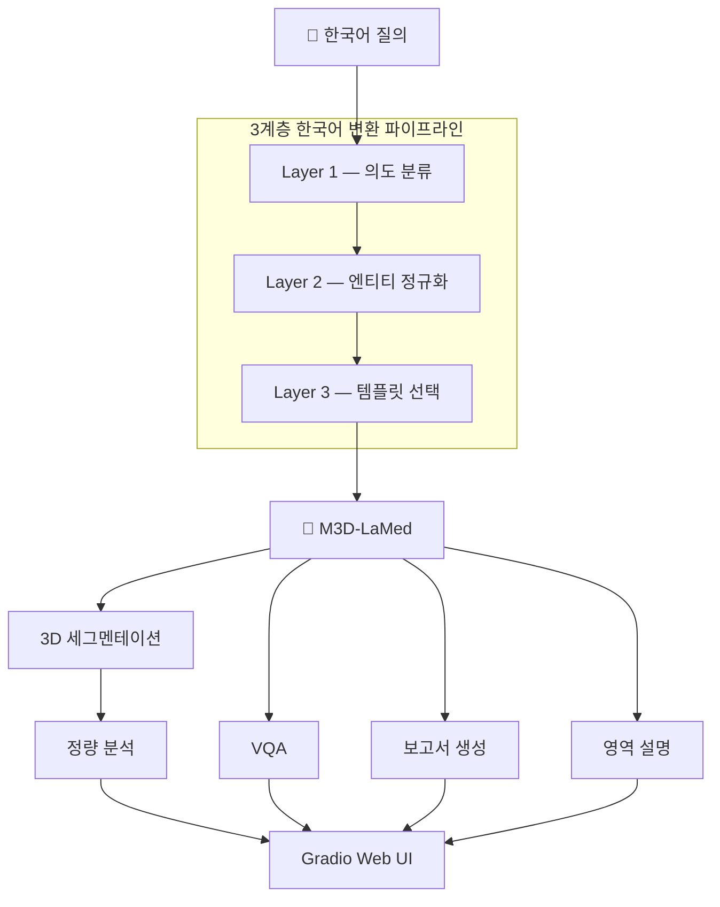
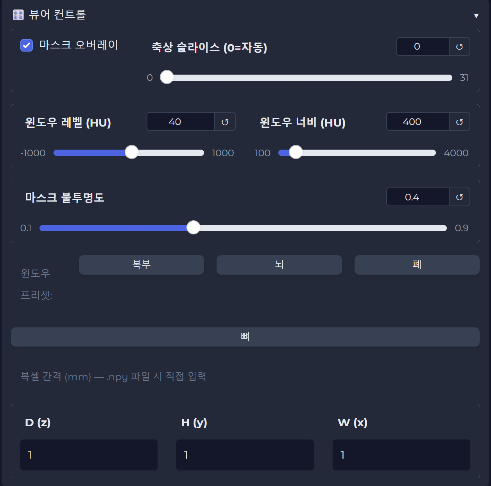
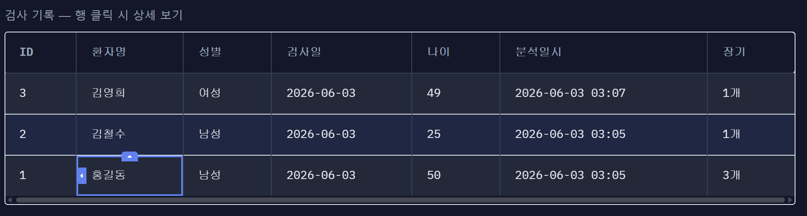

# MedSeg-3D-KO

<div align="center">

### Korean Prompt Transformation Pipeline for Medical Vision-Language Models


</div>

---

<div align="center">
  
</div>

---

## 개요

M3D-LaMed는 영어 기반 데이터로 학습된 의료 VLM(Vision Language Model)으로, 한국어 입력에 대한 동작이 공식적으로 검증되어 있지 않습니다.

본 프로젝트는 한국어 의료 질의를 입력으로 사용할 때 발생하는 성능 저하를 분석하고, 이를 해결하기 위한 **3계층 한국어 변환 파이프라인**을 제안합니다.

```text
"간 분할해줘"
        ↓
[3계층 한국어 변환 파이프라인]
        ↓
M3D-LaMed
        ↓
3D 세그멘테이션 + 정량 분석 + 임상 보고
```

많은 공개 의료 VLM들이 영어 중심 데이터로 학습되어 있으며, 한국어 질의 지원에 대한 연구는 상대적으로 부족합니다.

본 연구는 한국어 입력 실패 원인을 분석하고, 의료 도메인 특화 정규화와 프롬프트 최적화를 통해 문제를 해결하고자 하였습니다.

---

## Key Result

> ⚠️ 본 결과는 Task07 Pancreas (MSD) 5개 케이스를 대상으로 수행한 **Proof-of-Concept** 실험입니다. 통계적 일반화를 위한 대규모 검증은 향후 과제입니다.

| 입력 방식                    |    평균 Dice |
| ------------------------ | ---------: |
| 한국어 직접 입력                |     0.0000 |
| 일반 번역 (Google Translate) |     0.0000 |
| Layer 2 정규화              |     0.5457 |
| Full Pipeline (L1+L2+L3) | **0.5515** |

한국어 입력 시 완전히 실패하던 M3D-LaMed를 대상으로, 3계층 한국어 변환 파이프라인을 적용하여 실제 세그멘테이션이 가능한 수준으로 성능을 회복하였습니다.

---

## Contributions

1. 영어 중심 의료 VLM(M3D-LaMed)의 한국어 입력 실패 원인을 체계적으로 분석하였다.

   * 토크나이저 파편화
   * 장기명 표현 다양성
   * 프롬프트 패턴 의존성

2. 의도 분류(Intent Classification), 엔티티 정규화(Entity Normalization), 프롬프트 템플릿 선택(Prompt Template Selection)으로 구성된 **3계층 한국어 변환 파이프라인**을 제안하였다.

3. 7종의 실험을 통해 각 계층의 기여도를 정량적으로 분석하고 Ablation Study를 수행하였다.

4. 연구 결과를 검증하기 위한 CT 세그멘테이션 및 임상 분석 웹 애플리케이션을 구현하였다.

---

## M3D-LaMed

[M3D-LaMed](https://arxiv.org/abs/2404.00578)는 BAAI에서 개발한 3D 의료 영상 특화 VLM(Vision Language Model)입니다.

3D ViT로 CT 볼륨을 인코딩하고 LLM(Phi-3 또는 LLaMA)과 결합하여 다음과 같은 의료 영상 태스크를 지원합니다.

* Segmentation
* Visual Question Answering (VQA)
* Medical Report Generation
* Region Description
* Grounding

| 구성 요소                     | 역할             |
| ------------------------- | -------------- |
| 3D ViT Encoder            | CT 볼륨 → 공간 임베딩 |
| Spatial Pooling Perceiver | 3D 토큰 압축       |
| Phi-3 LLM (4B)            | 언어 이해          |
| SAM 3D Decoder            | 3D 세그멘테이션 생성   |

그러나 영어 기반 데이터로 학습되었기 때문에 한국어 입력 시 Dice Score가 0.0000으로 붕괴되는 현상이 발생합니다.

본 프로젝트는 이 문제를 해결하기 위한 한국어 입력 계층을 설계합니다.

---

## 시스템 아키텍처



---

## 3계층 한국어 변환 파이프라인

본 프로젝트의 핵심 연구 결과입니다.

| 계층      | 역할      | 방법            | 제거 시       |
| ------- | ------- | ------------- | ---------- |
| Layer 1 | 의도 분류   | 규칙 기반 분류기     | Dice 0.108 |
| Layer 2 | 엔티티 정규화 | 104종 의료 용어 사전 | Dice 0.000 |
| Layer 3 | 템플릿 선택  | 태스크별 프롬프트     | Dice 0.000 |

### Layer 2 — Entity Normalization

Layer 2는 다양한 표현을 M3D 학습 어휘(canonical form)로 정규화합니다.

```text
"신장"
"콩팥"
"kidney"
      ↓
   kidney
```

```text
"췌장"
"이자"
"pancreas"
      ↓
   pancreas
```

정규화 없이 한국어를 그대로 입력하면 토크나이저가 과도하게 파편화되어 임베딩 공간에서 전혀 다른 표현이 됩니다. (상세 분석: [EXPERIMENT.md](EXPERIMENT.md))

### Layer 3 — Template Selection

```text
SEG
→ Can you segment the {organ} in this image? Please output the mask.

VQA
→ What is the condition of the {organ} in this image?

REPORT
→ What are the main findings in this medical image?

REG
→ Describe the appearance and condition of the {organ} visible in this scan.
```

---

## 주요 기능

### 1. 한국어 자연어 질의

| 한국어 질의 | 의도 | 변환된 M3D 프롬프트 |
|-----------|:---:|-----------------|
| "간 분할해줘" | **SEG** | Can you segment the liver in this image? |
| "췌장 상태 어때?" | **VQA** | What is the condition of the pancreas in this image? |
| "소견서 써줘" | **REPORT** | What are the main findings in this medical image? |
| "비장 기능 설명해줘" | **REG** | Describe the appearance and condition of the spleen... |

<div align="center">
  
</div>

### 2. 다장기 3D 세그멘테이션

* 104종 해부학 구조 지원
* 축상 / 시상 / 관상면 3방향 동시 시각화
* NIfTI (.nii.gz) 마스크 다운로드 (원본 affine 보존)

<div align="center">
  
</div>


**CT 윈도우 프리셋** — 장기별 최적 HU 범위 자동 적용

| 프리셋 | WL | WW | 적합한 경우 |
|--------|:--:|:--:|-----------|
| 복부 | 40 | 400 | 간·췌장·비장 등 복부 장기 |
| 폐 | -600 | 1500 | 폐 실질·기도 |
| 뼈 | 400 | 1500 | 척추·골격 |
| 뇌 | 35 | 80 | 뇌 실질 |

<div align="center">
  
</div>


### 3. 임상 정량 분석

| 지표      | 설명              |
| ------- | --------------- |
| 부피 (mL) | 복셀 수 기반 계산 |
| 크기 (mm) | 바운딩박스 D × H × W |
| 임상 상태 | 정상 ✅ / 초과 ⚠️ / 미만 ⚠️ |

정상 범위 기준: 해부학 및 영상의학 교과서 기반 성인(18~65세) 참고값. 연령·성별 보정 적용.
> 참고: Gray's Anatomy, Radiology Reference Article (Radiopaedia), 대한영상의학회 표준 참고치

<div align="center">
  
</div>

### 4. VQA

자유로운 한국어 질의응답 지원

<div align="center">
  
</div>

### 5. 소견 생성

CT 전체를 분석하여 소견서를 생성

<div align="center">
  
</div>

### 6. 영역 설명

장기의 구조와 이상 소견 설명

<div align="center">
  
</div>

### 7. 환자 관리 및 종단적 추이

- SQLite 기반 환자 정보 저장
- 환자 식별 정보 마스킹 및 암호화 저장 (나이/성별 자동 추출)
- CSV 내보내기 (전체 / 환자별)

<div align="center">
  
  <br><sub>검사 이력 테이블</sub>
</div>

<br>

<div align="center">
  
  <br><sub>장기 부피 종단적 추이 차트</sub>
</div>

### 8. PDF 보고서

* CT 이미지
* 정량 결과
* 면책 문구 포함

<div align="center">
  
</div>

---

## 기술 스택

| 분류              | 기술                                          |
| --------------- | ------------------------------------------- |
| Base Model      | M3D-LaMed-Phi-3-4B                          |
| Deep Learning   | PyTorch, MONAI, Transformers                |
| Medical Imaging | SimpleITK, nibabel                          |
| UI              | Gradio                                      |
| Database        | SQLite                                      |
| Visualization   | Plotly, OpenCV                              |
| Translation     | Gemini 1.5 Flash, Google Translate Fallback |
| Environment     | Google Colab T4                             |

---

## 핵심 실험 결과

<div align="center">

[](EXPERIMENT.md)

</div>

본 연구는 개념 검증(Proof of Concept)을 목표로 수행되었으며 모든 실험은 동일한 5개 케이스(Task07 Pancreas, MSD)에서 비교 평가하였습니다.

### 실험 1. 번역 전략 비교

| 방법            |    평균 Dice |
| ------------- | ---------: |
| 한국어 직접 입력     |     0.0000 |
| 일반 번역         |     0.0000 |
| Layer 2 정규화   |     0.5457 |
| Full Pipeline | **0.5515** |

### 실험 2. Ablation Study

| 설정       |    평균 Dice |
| -------- | ---------: |
| Full     | **0.5515** |
| −Layer 1 |     0.1083 |
| −Layer 2 |     0.0000 |
| −Layer 3 |     0.0000 |

<div align="center">
  
</div>

---

## 한계 및 향후 과제

### 1. 출력 번역 품질

초기 버전은 Google Translate를 사용하였으며,
일부 의료 용어가 음차되거나 의미가 왜곡되는 문제가 있었습니다.

현재는 Gemini 1.5 Flash를 사용하여 번역 품질을 개선하였으나,
근본적으로는 한국어를 직접 이해할 수 있는 의료 VLM이 필요합니다.

### 2. VQA 질의 신뢰도

특정 질환이나 이상 소견을 직접 묻는 질문에서는
REG(장기 설명) 결과와 불일치가 발생하는 경우가 있습니다.

이는 모델의 학습 특성 또는 프롬프트 구조의 영향으로
추정되며 추가 검증이 필요합니다.

### 3. 구어체 및 혼합어 처리

Layer 2 사전에 존재하지 않는 표현,
오탈자, 한국어-영어 혼합 표현에 대해서는
정규화 성능이 저하될 수 있습니다.

### 4. 실험 규모 한계

본 연구의 정량 실험은
Task07 Pancreas 데이터셋의 5개 케이스를 대상으로 수행되었습니다.

다양한 장기와 대규모 데이터셋에 대한 추가 검증이 필요합니다.

### 5. 임상 정보 활용 한계

현재 정량 분석은 세그멘테이션 결과를 기반으로
부피 및 크기를 계산합니다.

형태학적 이상이나 영상학적 소견은 충분히 반영되지 않으므로
임상 소견 및 장기 설명 결과를 함께 참고해야 합니다.

## 향후 과제

- 한국어 의료 VLM 도입
- 의료 지식베이스 기반 RAG 적용
- 형태소 분석 및 퍼지 매칭을 통한 구어체 처리 강화
- 대규모 정량 평가 수행
- DICOM 포맷 직접 지원
- Grounding 태스크 구현
---

### 향후 과제

| 과제 | 방향 |
|------|------|
| **한국어 의료 VLM 도입** | 번역 레이어 없이 한국어를 직접 이해하는 모델로 교체 |
| **RAG 기반 출력 고도화** | 의료 지식베이스와 연동해 M3D 출력에 임상 근거 보완 |
| **구어체·혼합어 처리 강화** | 형태소 분석기(KoNLPy/Kiwi) + 퍼지 매칭으로 Layer 2 개선 |
| **대규모 정량 평가** | 더 많은 케이스·다양한 장기에 대한 Dice 검증 |
| **DICOM 포맷 지원** | 실제 병원 데이터 형식 직접 처리 |
| **Grounding 태스크** | 텍스트 → 3D 바운딩박스 좌표 변환 구현 |

---

## 디렉토리 구조

```
MedSeg-3D-KO/
├── app/
│   ├── gradio_app.py          # Gradio 웹 앱 메인
│   └── visualization.py       # 3방향 슬라이스 시각화
├── src/
│   ├── translation/
│   │   ├── pipeline.py        # 3계층 변환 파이프라인 (핵심)
│   │   ├── translator.py      # 한↔영 번역 레이어
│   │   └── medical_terms.py   # 104종 의료 용어 사전
│   ├── inference/
│   │   ├── model_loader.py    # M3D 모델 로드
│   │   └── segmentation.py    # 추론 파이프라인
│   ├── analysis/
│   │   ├── volume.py          # 부피·크기 계산
│   │   ├── clinical.py        # 정상범위 비교 / 임상 평가
│   │   └── report.py          # PDF 보고서 생성
│   └── database/
│       ├── db.py              # SQLite 연결 및 초기화
│       └── crud.py            # 환자 CRUD
├── notebooks/
│   ├── m3d_KO_run.ipynb                                  # Colab 실행 스크립트
│   ├── Med3D_Korean_Interface_Pipeline.ipynb             # 실험 1~4
│   ├── Korean_Medical_Query_Transformation_Experiment.ipynb  # 실험 5~7
│   └── M3D_KO_Prompt_Optimal.ipynb                       # 실험 4 (프롬프트 최적화)
├── EXPERIMENT.md              # 실험 전체 상세
└── requirements.txt
```

---

## Quick Start (Google Colab)

1. `notebooks/m3d_KO_run.ipynb` 열기
2. 셀 순서대로 실행 (모델 로드 약 5분)
3. 생성된 공개 URL 접속
4. CT 파일 업로드 후 한국어로 질문 입력

<details>
<summary>직접 실행 코드 보기</summary>

```python
# 1. 레포 클론 및 패키지 설치
!git clone https://github.com/yuji4/MedSeg3D-KO.git
%cd MedSeg3D-KO
!pip install -r requirements.txt
!apt-get install -y fonts-nanum -q

# 2. 모델 로드 (약 5분 소요)
import sys, torch
sys.path.insert(0, '/content/MedSeg3D-KO')

from transformers import AutoTokenizer, AutoModelForCausalLM

model_name = "GoodBaiBai88/M3D-LaMed-Phi-3-4B"
tokenizer = AutoTokenizer.from_pretrained(
    model_name, model_max_length=512,
    padding_side="right", use_fast=False, trust_remote_code=True,
)
model = AutoModelForCausalLM.from_pretrained(
    model_name, torch_dtype=torch.bfloat16,
    device_map='auto', trust_remote_code=True,
)

# 3. 앱 실행
from src.inference.segmentation import SegmentationPipeline
import app.gradio_app as app_module

pipeline = SegmentationPipeline()
pipeline.model = model
pipeline.tokenizer = tokenizer
pipeline._device = next(model.parameters()).device
app_module._pipeline = pipeline

app_module.demo.queue()
app_module.demo.launch(share=True)
```

> ⚠️ T4 GPU 환경 권장.

</details>

---

## 데이터셋

| 데이터셋                  | 설명           | 용도    |
| --------------------- | ------------ | ----- |
| Task07 Pancreas (MSD) | 췌장 CT 281케이스 | 정량 평가 |
| NVIDIA Sample CT      | 복부 CT        | 데모    |

---

## Disclaimer

본 프로젝트는 연구 및 과제 목적의 프로토타입입니다.

생성된 세그멘테이션 결과, 임상 수치, 보고서 및 질의응답 결과는 의학적 진단을 대체할 수 없으며 실제 의료 행위에 사용되어서는 안 됩니다.
