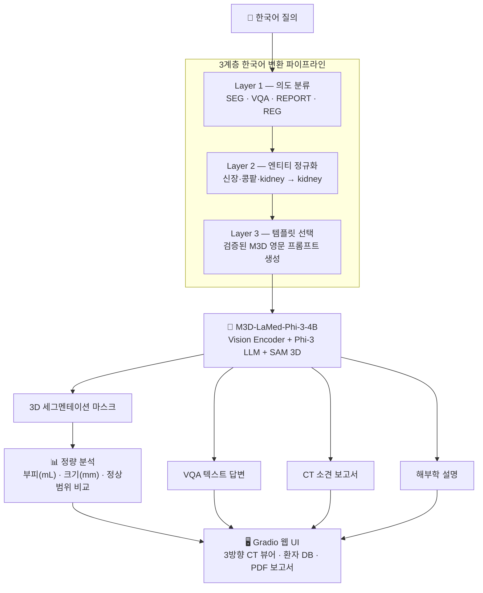

# MedSeg-3D-KO

<div align="center">

### 한국어 의료 질의를 M3D-LaMed가 이해할 수 있는 프롬프트로 변환하는 3계층 파이프라인 연구 및 CT 세그멘테이션 시스템


</div>

---


---

## 개요

M3D-LaMed는 영어 기반 데이터로 학습된 의료 VLM으로, 한국어 입력에 대한 동작이 공식적으로 검증되어 있지 않습니다.

본 프로젝트는 한국어 의료 질의를 입력으로 사용할 때 발생하는 성능 저하를 분석하고, 이를 해결하기 위한 **3계층 한국어 변환 파이프라인**을 제안합니다.

```
"간 분할해줘"  →  [3계층 파이프라인]  →  M3D-LaMed  →  3D 마스크 + 부피(mL) + 임상 평가
```

많은 공개 의료 VLM들이 영어 중심 데이터로 학습되어 있으며, 한국어 질의 지원에 대한 연구는 상대적으로 부족합니다. 일반 번역기를 사용해도 M3D는 여전히 실패하며 (Dice 0.000), 의료 도메인 특화 정규화가 필수임을 7종의 실험으로 확인하고 최적 파이프라인을 설계했습니다.

---

## Contributions

1. 영어 전용 의료 VLM(M3D-LaMed)에 대해 한국어 질의 입력 실패 원인을 체계적으로 분석하였다. (토크나이저 파편화, 프롬프트 패턴 의존성)
2. 의도 분류, 엔티티 정규화, 프롬프트 템플릿 선택으로 구성된 **3계층 한국어 변환 파이프라인**을 제안하였다.
3. 7종의 실험을 통해 각 계층의 기여도를 정량적으로 검증하고, 계층 간 중요도를 ablation study로 측정하였다.
4. 연구 결과를 실제 사용 가능한 CT 세그멘테이션 및 임상 분석 웹 애플리케이션으로 구현하였다.

---

## M3D-LaMed

[M3D-LaMed](https://arxiv.org/abs/2404.00578)는 BAAI에서 개발한 3D 의료 영상 특화 VLM(Vision Language Model)입니다. 3D ViT로 CT 볼륨을 인코딩하고 LLM(Phi-3 또는 LLaMA)과 결합해 세그멘테이션, VQA, 보고서 생성 등 8가지 의료 영상 태스크를 지원합니다.

| 구성 요소 | 역할 |
|-----------|------|
| 3D ViT Encoder | CT 볼륨 (32×256×256) → 공간 임베딩 |
| Spatial Pooling Perceiver | 3D 토큰 압축 및 LLM 입력 정렬 |
| Phi-3 LLM (4B) | 언어 이해 + `[SEG]` 토큰 생성 |
| SAM 3D Decoder | `[SEG]` 토큰 → 3D 세그멘테이션 마스크 |

학습 데이터가 영어 기반이라 한국어 입력 시 Dice **0.0000**으로 완전 실패합니다. MedSeg-3D-KO는 이 문제를 3계층 파이프라인으로 해결합니다.

---

## 시스템 아키텍처



---

## 3계층 한국어 변환 파이프라인

본 프로젝트의 핵심 연구 결과로, 7종의 실험을 통해 도출한 최적 구조입니다.

| 계층 | 역할 | 방법 | 제거 시 |
|------|------|------|--------|
| **Layer 1** 의도 분류 | SEG / VQA / REPORT / REG 판별 | 규칙 기반 키워드 (정확도 92%, F1 0.92) | Dice 0.108, σ=0.22 (불안정) |
| **Layer 2** 엔티티 정규화 ★ | 한국어 장기명 → 영문 canonical form | 104종 의료 용어 사전 | Dice 0.000 (완전 실패) |
| **Layer 3** 템플릿 선택 | 태스크별 최적 M3D 프롬프트 | 검증된 4가지 템플릿 | Dice 0.000 (완전 실패) |

### Layer 2가 핵심인 이유 — 토크나이저 분석

M3D의 토크나이저는 Phi-3 기반으로 한국어에 최적화되어 있지 않습니다. Layer 2는 표현이 달라도 같은 의미를 가진 한국어 장기명을 M3D 학습 어휘의 canonical form으로 정규화합니다.

```
"신장" ┐
"콩팥" ┤ → kidney   (M3D 학습 어휘)
"kidney" ┘

"췌장" ┐
"이자" ┤ → pancreas
"pancreas" ┘
```

정규화 없이 한국어를 그대로 전달하면 토크나이저가 과도하게 파편화하여 임베딩 공간에서 전혀 다른 표현이 됩니다.

| 한국어 | 영어 | 한국어 토큰 수 | 영어 토큰 수 |
|--------|------|:---:|:---:|
| 간 | liver | 4 | 2 |
| 신장 | kidney | 3 | 2 |
| 췌장 | pancreas | 5 | 3 |
| 콩팥 (구어체) | kidney | **7** | 2 |
| 대동맥 | aorta | **6** | 3 |

### Layer 3 — 태스크별 검증 템플릿

```
SEG    → "Can you segment the {organ} in this image? Please output the mask."
VQA    → "What is the condition of the {organ} in this image?"
REPORT → "What are the main findings in this medical image? Describe any abnormalities
           or notable observations visible in the scan."
REG    → "Describe the appearance and condition of the {organ} visible in this scan.
           Note its size, shape, and any observable abnormalities."
```

---

## 주요 기능

### 1. 한국어 자연어 질의

4가지 M3D 태스크를 한국어로 자유롭게 요청할 수 있습니다. 3계층 파이프라인이 의도를 분류하고 최적 프롬프트로 변환합니다.

```
"간 분할해줘"         → SEG    → Can you segment the liver in this image? Please output the mask.
"췌장 상태 어때?"     → VQA    → What is the condition of the pancreas in this image?
"소견서 써줘"         → REPORT → What are the main findings in this medical image?
"비장 기능 설명해줘"  → REG    → Describe the appearance and condition of the spleen...
```


---

### 2. 다장기 3D 세그멘테이션

104종 해부학 구조물을 한 번의 질문으로 동시에 세그멘테이션하고, 축상·시상·관상 3방향 슬라이스에 색상별로 오버레이합니다.

- **윈도우 프리셋:** 복부 / 폐 / 뼈 / 뇌 4종 (HU 수동 조절 가능)
- **마스크 다운로드:** NIfTI 형식 (.nii.gz), 원본 affine 정보 보존


---

### 3. 임상 정량 분석

세그멘테이션 마스크에서 임상 수치를 자동 계산하고 성인 정상범위와 비교합니다.

| 지표 | 설명 |
|------|------|
| 부피 (mL) | 복셀 크기 × 복셀 수 |
| 크기 (mm) | 축별 바운딩박스 D × H × W |
| 임상 상태 | 정상 ✅ / 초과 ⚠️ / 미만 ⚠️ (연령·성별 보정) |

| 장기 | 정상 범위 |
|------|-----------|
| 간 | 1,000 ~ 1,500 mL |
| 신장 (편측) | 90 ~ 160 mL |
| 비장 | 100 ~ 314 mL |
| 췌장 | 50 ~ 100 mL |


---

### 4. VQA (질의응답)

"정상인가요?", "이상 소견 있나요?" 같은 자유로운 한국어 질문에 M3D가 영상을 분석해 답변합니다. 응답은 한국어로 자동 번역됩니다.


---

### 5. 소견 생성

"소견서 써줘"라고 하면 CT 전체를 분석해 주요 이상 소견을 요약한 보고서 형식의 텍스트를 생성합니다.


---

### 6. 영역 설명 (REG)

특정 장기의 해부학적 구조, 기능, 이상 소견을 자세히 설명합니다.


---

### 7. 환자 관리 및 종단적 추이

SQLite 기반 환자 정보 저장 및 장기 부피 변화 추이를 인터랙티브 차트로 확인할 수 있습니다.

- 주민등록번호 자동 파싱 (나이/성별), 뒷자리 마스킹 `000000-*******`, 암호화 저장
- CSV 내보내기 (전체 / 환자별)


---

### 8. PDF 보고서 자동 생성

3방향 CT 이미지 + 장기별 결과표 + 한국어 면책 고지를 포함한 PDF를 자동으로 생성합니다.


---

## 기술 스택

| 분류 | 기술 |
|------|------|
| 베이스 모델 | M3D-LaMed-Phi-3-4B (HuggingFace) |
| 딥러닝 | PyTorch 2.2, MONAI 1.3, Transformers 4.41 |
| 의료 영상 | SimpleITK 2.3, nibabel 5.2 |
| UI | Gradio 4.0+ |
| DB / 보고서 | SQLite3, fpdf2 |
| 시각화 | Plotly, Matplotlib, OpenCV |
| 번역 | deep-translator (GoogleTranslator) |
| 실행 환경 | Google Colab T4 GPU |

---

## 핵심 실험 결과

> 실험 전체 상세 (7종, 방법·결과·분석·종합 결론) → **[EXPERIMENT.md](EXPERIMENT.md)**

본 실험은 개념 검증(Proof of Concept)을 목적으로 수행되었으며, 모든 실험은 동일한 5개 케이스에서 비교 평가하였습니다. (Task07 Pancreas, MSD)

### 실험 1: 번역 전략 비교 — 파이프라인이 필요한 이유

| 방법 | 평균 Dice | 비고 |
|------|:---------:|------|
| 한국어 직접 입력 | 0.0000 | `[SEG]` 토큰 미생성 |
| 일반 번역 (GoogleTranslate) | 0.0000 | "Split the pancreas" → 실패 |
| 의료 사전 정규화 (Layer 2만) | 0.5457 | 장기명 정규화만으로도 급격히 회복 |
| **3계층 Full 파이프라인** | **0.5515** | 최고 성능 |

### 실험 2: Ablation Study — 각 계층의 기여도

| 설정 | 평균 Dice | 비고 |
|------|:---------:|------|
| **Full (L1+L2+L3)** | **0.5515** | 최고 성능 |
| −Layer 1 (랜덤 템플릿) | 0.1083 | 불안정 (σ=0.22) |
| −Layer 2 (정규화 제거) | 0.0000 | 완전 실패 |
| −Layer 3 (템플릿 제거) | 0.0000 | 완전 실패 |

**Layer 2 > Layer 3 > Layer 1** 순으로 기여도가 크며, 세 계층 모두 필수입니다.


---

## 한계 및 향후 과제

### 1. 출력 번역 품질 ✅ 개선 완료

초기에는 GoogleTranslator를 사용해 의료 용어가 어색하게 번역되거나 오역이 발생했습니다. Gemini 1.5 Flash API를 도입해 의학 판독문 수준의 한국어 번역을 달성했습니다.

```
GoogleTranslate: "안다테(andates)가 있다. 지방간과 호환되는 간 밀도가 증가합니다."
Gemini:          "지방침윤의 징후를 보입니다. 동맥기의 강화를 나타냅니다."
```

Gemini 1.5 Flash 우선, API 키 없으면 GoogleTranslate로 자동 fallback. 근본적인 해결책은 한국어로 학습된 의료 VLM을 사용하는 것이며, 현재는 번역 레이어로 보완합니다.

### 2. VQA 특정 병명 질의 신뢰도 낮음

"간에 지방침윤이 있나요?" 같이 특정 병명을 직접 묻는 VQA는 신뢰도가 낮습니다.

- REG(장기 설명)에서는 "지방침윤 징후가 보인다"고 하면서, VQA에서는 "없다"고 답하는 불일치가 발생합니다.
- 원인 1: VQA 템플릿이 질문을 "What is the condition of X?"로 일반화해 구체적인 병명이 사라집니다.
- 원인 2: M3D의 VQA 학습 데이터가 특정 병명 유무를 묻는 질의보다 전반적 상태 판단에 편향되어 있습니다.

**권장 사용법:** 특정 이상 소견 확인은 VQA보다 **장기 설명(REG)** 을 사용하고, 결과를 사용자가 직접 판단하는 것이 더 신뢰할 수 있습니다.

### 3. 임상 소견과 장기 설명의 정보 차이

임상 소견과 장기 설명은 서로 다른 소스에서 정보를 가져와 불일치처럼 보일 수 있습니다.

| 항목 | 소스 | 평가 기준 |
|------|------|---------|
| 임상 소견 (부피) | 세그멘테이션 마스크 계산 | 크기만 판단 (형태·밀도 미반영) |
| 장기 설명 (REG) | M3D CT 이미지 분석 | 시각적 이상 소견 묘사 |

간이 정상 크기여도 지방침윤이 있을 수 있고, 반대로 비대하더라도 구조적으로 정상일 수 있습니다. 두 결과를 함께 참고해야 합니다.

### 4. 부피 기준 없는 장기

위(stomach), 십이지장(duodenum), 대장(colon), 혈관류(대동맥 등)는 세그멘테이션은 정상 작동하지만, 부피 정상범위 기준이 없어 임상 평가에서 "참고범위 없음"으로 표시됩니다.

### 5. 구어체 및 혼합어 처리 미흡

Layer 2 용어 사전에 없는 구어체나 한영 혼합어 입력 시 토큰화 오류가 발생합니다.

| 입력 예시 | 문제 | 향후 개선 |
|----------|------|---------|
| "이자 분할해줘" | 사전 미등록 → 오류 | 용어 사전 확충 |
| "pancreas 분할해줘" | 혼합 토큰화 오류 | 혼합어 전처리 로직 추가 |

### 6. Layer 1 경계 표현 오분류

규칙 기반 분류기는 의도가 경계에 걸친 표현에서 오분류합니다. (50개 테스트 중 4건)

| 오분류 예시 | 원인 | 향후 개선 |
|------------|------|---------|
| "췌장만 보고싶어" → VQA | SEG 키워드 없음 | 키워드 확충 또는 분류 모델 도입 |
| "이상 소견 있나?" → Report | "소견" 키워드 충돌 | 우선순위 규칙 조정 |

### 7. 실험 규모의 한계

모든 정량 실험이 5개 케이스, 단일 장기(췌장) 기준으로 수행되었습니다. M3D 추론 비용(케이스당 약 30초)으로 인한 현실적 제약이며, 다른 장기로의 일반화 가능성은 추가 검증이 필요합니다.

### 8. Grounding 태스크 미구현

M3D가 공식 지원하는 Grounding(텍스트 → 3D 바운딩박스 좌표) 태스크는 구현되지 않았습니다. 세그멘테이션으로 대부분의 위치 확인이 가능하므로 실용적 영향은 제한적입니다.

## 디렉토리 구조

```
MedSeg-3D-KO/
├── app/
│   ├── gradio_app.py          # Gradio 웹 앱 메인
│   └── visualization.py       # 3방향 슬라이스 시각화
├── src/
│   ├── translation/
│   │   ├── pipeline.py        # 3계층 변환 파이프라인 (핵심)
│   │   ├── translator.py      # 한↔영 번역 레이어
│   │   └── medical_terms.py   # 104종 의료 용어 사전
│   ├── inference/
│   │   ├── model_loader.py    # M3D 모델 로드
│   │   └── segmentation.py    # 추론 파이프라인
│   ├── analysis/
│   │   ├── volume.py          # 부피·크기 계산
│   │   ├── clinical.py        # 정상범위 비교 / 임상 평가
│   │   └── report.py          # PDF 보고서 생성
│   └── database/
│       ├── db.py              # SQLite 연결 및 초기화
│       └── crud.py            # 환자 CRUD
├── notebooks/
│   ├── m3d_KO_run.ipynb                                      # Colab 실행 스크립트
│   ├── Med3D_Korean_Interface_Pipeline_Experiment.ipynb      # 실험 1~4
│   ├── Korean_Medical_Query_Transformation_Experiment.ipynb  # 실험 5~7
│   └── M3D_KO_Prompt_Optimal.ipynb                           # 실험 4 (프롬프트 최적화)
├── EXPERIMENT.md              # 실험 전체 상세
└── requirements.txt
```

---

## Quick Start (Google Colab)

1. `notebooks/m3d_KO_run.ipynb` 열기
2. 셀 순서대로 실행 (모델 로드 약 5분)
3. 생성된 공개 URL 접속
4. CT 파일 업로드 후 한국어로 질문 입력

<details>
<summary>직접 실행 코드 보기</summary>

```python
# 1. 레포 클론 및 패키지 설치
!git clone https://github.com/yuji4/MedSeg3D-KO.git
%cd MedSeg3D-KO
!pip install -r requirements.txt
!apt-get install -y fonts-nanum -q

# 2. 모델 로드
import sys, torch
sys.path.insert(0, '/content/MedSeg3D-KO')

from transformers import AutoTokenizer, AutoModelForCausalLM

model_name = "GoodBaiBai88/M3D-LaMed-Phi-3-4B"
tokenizer = AutoTokenizer.from_pretrained(
    model_name, model_max_length=512,
    padding_side="right", use_fast=False, trust_remote_code=True,
)
model = AutoModelForCausalLM.from_pretrained(
    model_name, torch_dtype=torch.bfloat16,
    device_map='auto', trust_remote_code=True,
)

# 3. 앱 실행
from src.inference.segmentation import SegmentationPipeline
import app.gradio_app as app_module

pipeline = SegmentationPipeline()
pipeline.model = model
pipeline.tokenizer = tokenizer
pipeline._device = next(model.parameters()).device
app_module._pipeline = pipeline

app_module.demo.queue()
app_module.demo.launch(share=True)
```

> ⚠️ T4 GPU 환경 권장.

</details>

---

## 데이터셋

| 데이터셋 | 설명 | 용도 |
|---------|------|------|
| [Task07 Pancreas (MSD)](http://medicaldecathlon.com/) | 췌장 CT + GT 마스크 281케이스 | 실험 정량 평가 (5케이스 사용) |
| NVIDIA Sample CT | 복부 CT 3케이스 | 데모 및 기능 테스트 |

---

## 참고

- [M3D: Advancing 3D Medical Image Analysis](https://arxiv.org/abs/2404.00578)
- [M3D GitHub](https://github.com/BAAI-DCAI/M3D)
- [M3D-LaMed-Phi-3-4B (HuggingFace)](https://huggingface.co/GoodBaiBai88/M3D-LaMed-Phi-3-4B)
- [Medical Segmentation Decathlon](http://medicaldecathlon.com/)

---

## Disclaimer

본 프로젝트는 연구 및 교육 목적의 프로토타입입니다. 생성된 세그멘테이션 결과, 임상 수치, 보고서 및 질의응답 결과는 의학적 진단을 대체할 수 없으며, 실제 의료 행위에 사용되어서는 안 됩니다.