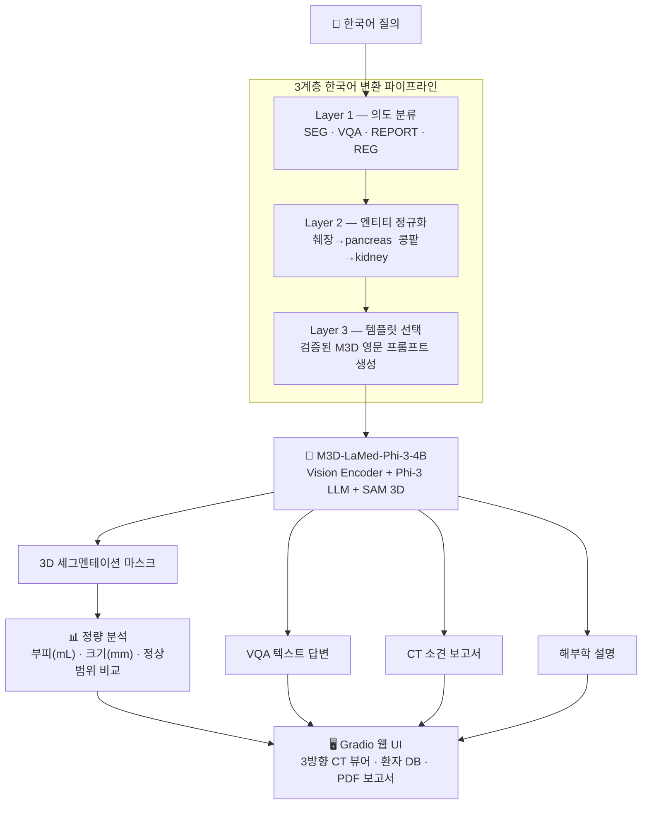

# MedSeg-3D-KO

<div align="center">

### 한국어로 CT를 물어보면, 장기를 세그멘테이션해서 임상 분석 결과를 드립니다


</div>

---


---

## 무엇인가요?

M3D-LaMed는 영어 프롬프트로만 작동합니다. 한국어로 "췌장 분할해줘"라고 물으면 Dice Score **0.0000** — 완전히 실패합니다.

MedSeg-3D-KO는 **3계층 한국어 변환 파이프라인**을 설계해 이 문제를 해결하고, 한국어 질의 기반 CT 세그멘테이션 + 임상 분석 웹 앱을 구현한 프로젝트입니다.

```
"간 분할해줘"  →  [3계층 파이프라인]  →  M3D-LaMed  →  3D 마스크 + 부피(mL) + 임상 평가
```

---

## 시스템 아키텍처



---

## 주요 기능

### 1. 한국어 자연어 질의

4가지 M3D 태스크를 한국어로 자유롭게 요청할 수 있습니다. 3계층 파이프라인이 자동으로 의도를 분류하고 최적 프롬프트로 변환합니다.

```
"간 분할해줘"         → SEG    → Can you segment the liver in this image? Please output the mask.
"췌장 상태 어때?"     → VQA    → What is the condition of the pancreas in this image?
"소견서 써줘"         → REPORT → What are the main findings in this medical image?
"비장 기능 설명해줘"  → REG    → Describe the appearance and condition of the spleen...
```


---

### 2. 다장기 3D 세그멘테이션

104종 해부학 구조물을 한 번의 질문으로 동시에 세그멘테이션하고, 축상·시상·관상 3방향 슬라이스에 색상별로 오버레이합니다.

- **윈도우 프리셋:** 복부 / 폐 / 뼈 / 뇌 4종 (HU 수동 조절 가능)
- **마스크 다운로드:** NIfTI 형식 (.nii.gz), 원본 affine 정보 보존


---

### 3. 임상 정량 분석

세그멘테이션 마스크에서 자동으로 임상 수치를 계산하고 성인 정상범위와 비교합니다.

| 지표 | 설명 |
|------|------|
| 부피 (mL) | 복셀 크기 × 복셀 수 |
| 크기 (mm) | 축별 바운딩박스 D × H × W |
| 임상 상태 | 정상 ✅ / 초과 ⚠️ / 미만 ⚠️ (연령·성별 보정) |


---

### 4. VQA / 소견 생성 / 영역 설명

M3D의 멀티태스크 기능을 한국어로 지원합니다. 모델 출력은 한국어로 자동 번역됩니다.


---

### 5. 환자 관리 및 종단적 추이

SQLite 기반 환자 정보 저장 및 장기 부피 변화 추이를 인터랙티브 차트로 확인할 수 있습니다.

- 주민등록번호 자동 파싱 (나이/성별), 뒷자리 마스킹 `000000-*******`, 암호화 저장
- CSV 내보내기 (전체 / 환자별)


---

### 6. PDF 보고서 자동 생성

3방향 CT 이미지 + 장기별 결과표 + 한국어 면책 고지를 포함한 PDF를 자동으로 생성합니다.


---

## 기술 스택

| 분류 | 기술 |
|------|------|
| 베이스 모델 | M3D-LaMed-Phi-3-4B (HuggingFace) |
| 딥러닝 | PyTorch 2.2, MONAI 1.3, Transformers 4.41 |
| 의료 영상 | SimpleITK 2.3, nibabel 5.2 |
| UI | Gradio 4.0+ |
| DB / 보고서 | SQLite3, fpdf2 |
| 시각화 | Plotly, Matplotlib, OpenCV |
| 번역 | deep-translator (GoogleTranslator) |
| 실행 환경 | Google Colab T4 GPU |

---

## 핵심 실험 결과

> 실험 전체 상세 (7종, 의도·가설·결과·종합 결론) → **[EXPERIMENT.md](EXPERIMENT.md)**

### 실험 1: 번역 전략 비교 — 왜 파이프라인이 필요한가

> "한국어 입력을 그냥 번역기로 넘기면 안 되는가?" (n=5, Task07 췌장)

| 방법 | Dice | 비고 |
|------|:----:|------|
| 한국어 직접 입력 | 0.0000 | `[SEG]` 토큰 미생성 |
| 일반 번역 (GoogleTranslate) | 0.0000 | "Split the pancreas" → 실패 |
| 의료 사전 정규화 (Layer 2만) | 0.5457 | 장기명만 맞춰도 급격히 회복 |
| **3계층 Full 파이프라인** | **0.5515** | 최고 성능 |

### 실험 2: Ablation Study — 각 계층이 정말 필요한가

> "계층을 하나씩 빼면 성능이 어떻게 변하는가?" (n=5)

| 설정 | Dice | 해석 |
|------|:----:|------|
| **Full (L1+L2+L3)** | **0.5515** | 최고 성능 |
| −Layer 1 (랜덤 템플릿) | 0.1083 | 불안정 (σ=0.22) |
| −Layer 2 (정규화 제거) | 0.0000 | 완전 실패 |
| −Layer 3 (템플릿 제거) | 0.0000 | 완전 실패 |

> **Layer 2 > Layer 3 > Layer 1** 순으로 기여도가 큽니다. 세 계층 모두 필수입니다.

---

## 디렉토리 구조

```
MedSeg-3D-KO/
├── app/
│   ├── gradio_app.py          # Gradio 웹 앱 메인
│   └── visualization.py       # 3방향 슬라이스 시각화
├── src/
│   ├── translation/
│   │   ├── pipeline.py        # 3계층 변환 파이프라인 (핵심)
│   │   ├── translator.py      # 한↔영 번역 레이어
│   │   └── medical_terms.py   # 104종 의료 용어 사전
│   ├── inference/
│   │   ├── model_loader.py    # M3D 모델 로드
│   │   └── segmentation.py    # 추론 파이프라인
│   ├── analysis/
│   │   ├── volume.py          # 부피·크기 계산
│   │   ├── clinical.py        # 정상범위 비교 / 임상 평가
│   │   └── report.py          # PDF 보고서 생성
│   └── database/
│       ├── db.py              # SQLite 연결 및 초기화
│       └── crud.py            # 환자 CRUD
├── notebooks/
│   ├── m3d_KO_run.ipynb                                      # Colab 실행 스크립트
│   ├── Med3D_Korean_Interface_Pipeline_Experiment.ipynb      # 실험 1~4
│   ├── Korean_Medical_Query_Transformation_Experiment.ipynb  # 실험 5~7
│   └── M3D_KO_Prompt_Optimal.ipynb                           # 실험 4 (프롬프트 최적화)
├── EXPERIMENT.md              # 실험 전체 상세
└── requirements.txt
```

---

## 실행 방법 (Google Colab)

```python
# 1. 레포 클론 및 패키지 설치
!git clone https://github.com/yuji4/MedSeg3D-KO.git
%cd MedSeg3D-KO
!pip install -r requirements.txt
!apt-get install -y fonts-nanum -q   # 한국어 폰트 (PDF 보고서용)

# 2. 모델 로드 (약 5분 소요)
import sys, torch
sys.path.insert(0, '/content/MedSeg3D-KO')

from transformers import AutoTokenizer, AutoModelForCausalLM

model_name = "GoodBaiBai88/M3D-LaMed-Phi-3-4B"
tokenizer = AutoTokenizer.from_pretrained(
    model_name, model_max_length=512,
    padding_side="right", use_fast=False, trust_remote_code=True,
)
model = AutoModelForCausalLM.from_pretrained(
    model_name, torch_dtype=torch.bfloat16,
    device_map='auto', trust_remote_code=True,
)

# 3. 앱 실행
from src.inference.segmentation import SegmentationPipeline
import app.gradio_app as app_module

pipeline = SegmentationPipeline()
pipeline.model = model
pipeline.tokenizer = tokenizer
pipeline._device = next(model.parameters()).device
app_module._pipeline = pipeline

app_module.demo.queue()
app_module.demo.launch(share=True)
```

> ⚠️ T4 GPU 환경 권장.

---

## 참고

- [M3D: Advancing 3D Medical Image Analysis](https://arxiv.org/abs/2404.00578)
- [M3D GitHub](https://github.com/BAAI-DCAI/M3D)
- [M3D-LaMed-Phi-3-4B (HuggingFace)](https://huggingface.co/GoodBaiBai88/M3D-LaMed-Phi-3-4B)
- [Medical Segmentation Decathlon](http://medicaldecathlon.com/)