# MedSeg-3D-KO

<div align="center">

### 한국어 의료 질의를 M3D-LaMed가 이해할 수 있는 프롬프트로 변환하는 3계층 파이프라인 연구 및 CT 세그멘테이션 시스템


</div>

---

## 개요

M3D-LaMed는 영어 기반 데이터로 학습된 의료 VLM(Vision Language Model)으로, 한국어 입력에 대한 동작이 공식적으로 검증되어 있지 않습니다.

본 프로젝트는 한국어 의료 질의를 입력으로 사용할 때 발생하는 성능 저하를 분석하고, 이를 해결하기 위한 **3계층 한국어 변환 파이프라인**을 제안합니다.

```text
"간 분할해줘"
        ↓
[3계층 한국어 변환 파이프라인]
        ↓
M3D-LaMed
        ↓
3D 세그멘테이션 + 정량 분석 + 임상 보고
```

많은 공개 의료 VLM들이 영어 중심 데이터로 학습되어 있으며, 한국어 질의 지원에 대한 연구는 상대적으로 부족합니다.

본 연구는 한국어 입력 실패 원인을 분석하고, 의료 도메인 특화 정규화와 프롬프트 최적화를 통해 문제를 해결하고자 하였습니다.

---

## Contributions

1. 영어 중심 의료 VLM(M3D-LaMed)의 한국어 입력 실패 원인을 체계적으로 분석하였다.

   * 토크나이저 파편화
   * 장기명 표현 다양성
   * 프롬프트 패턴 의존성

2. 의도 분류(Intent Classification), 엔티티 정규화(Entity Normalization), 프롬프트 템플릿 선택(Prompt Template Selection)으로 구성된 **3계층 한국어 변환 파이프라인**을 제안하였다.

3. 7종의 실험을 통해 각 계층의 기여도를 정량적으로 분석하고 Ablation Study를 수행하였다.

4. 연구 결과를 검증하기 위한 CT 세그멘테이션 및 임상 분석 웹 애플리케이션을 구현하였다.

---

## Key Result

Task07 Pancreas (MSD) 데이터셋 5개 케이스를 대상으로 수행한 개념 검증(Proof of Concept) 결과입니다.

| 입력 방식                    |    평균 Dice |
| ------------------------ | ---------: |
| 한국어 직접 입력                |     0.0000 |
| 일반 번역 (Google Translate) |     0.0000 |
| Layer 2 정규화              |     0.5457 |
| Full Pipeline (L1+L2+L3) | **0.5515** |

한국어 입력 시 완전히 실패하던 M3D-LaMed를 대상으로, 3계층 한국어 변환 파이프라인을 적용하여 실제 세그멘테이션이 가능한 수준으로 성능을 회복하였습니다.

---

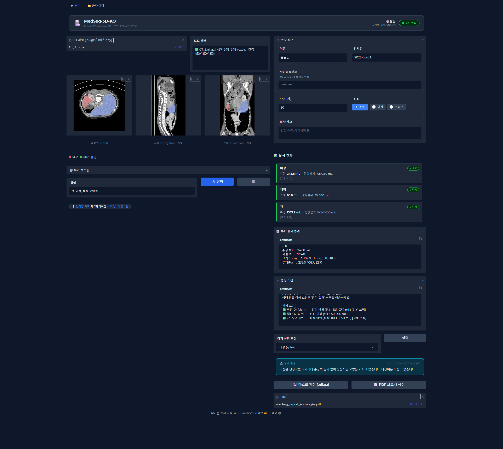

---

## M3D-LaMed

[M3D-LaMed](https://arxiv.org/abs/2404.00578)는 BAAI에서 개발한 3D 의료 영상 특화 VLM(Vision Language Model)입니다.

3D ViT로 CT 볼륨을 인코딩하고 LLM(Phi-3 또는 LLaMA)과 결합하여 다음과 같은 의료 영상 태스크를 지원합니다.

* Segmentation
* Visual Question Answering (VQA)
* Medical Report Generation
* Region Description
* Grounding

| 구성 요소                     | 역할             |
| ------------------------- | -------------- |
| 3D ViT Encoder            | CT 볼륨 → 공간 임베딩 |
| Spatial Pooling Perceiver | 3D 토큰 압축       |
| Phi-3 LLM (4B)            | 언어 이해          |
| SAM 3D Decoder            | 3D 세그멘테이션 생성   |

그러나 영어 기반 데이터로 학습되었기 때문에 한국어 입력 시 Dice Score가 0.0000으로 붕괴되는 현상이 발생합니다.

본 프로젝트는 이 문제를 해결하기 위한 한국어 입력 계층을 설계합니다.

---

## 시스템 아키텍처

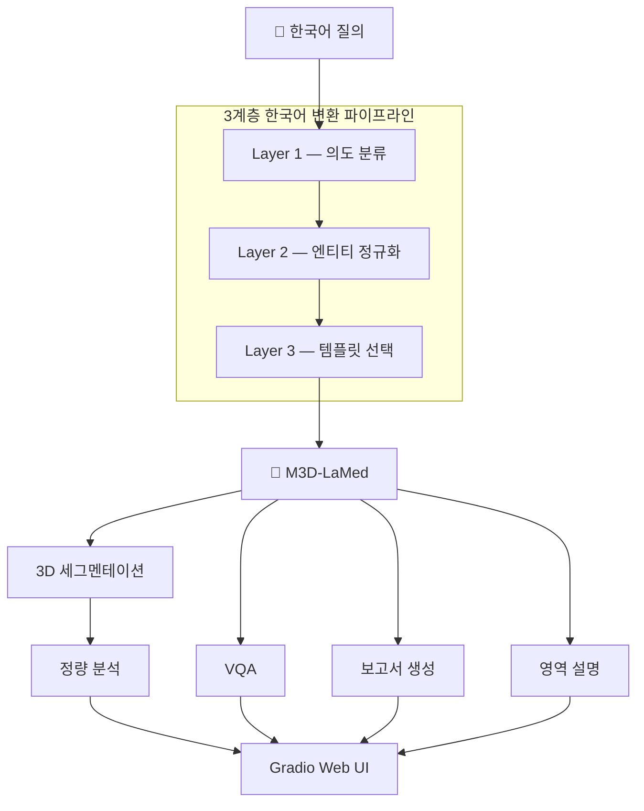

---

## 3계층 한국어 변환 파이프라인

본 프로젝트의 핵심 연구 결과입니다.

| 계층      | 역할      | 방법            | 제거 시       |
| ------- | ------- | ------------- | ---------- |
| Layer 1 | 의도 분류   | 규칙 기반 분류기     | Dice 0.108 |
| Layer 2 | 엔티티 정규화 | 104종 의료 용어 사전 | Dice 0.000 |
| Layer 3 | 템플릿 선택  | 태스크별 프롬프트     | Dice 0.000 |

### Layer 2 — Entity Normalization

Layer 2는 다양한 표현을 M3D 학습 어휘(canonical form)로 정규화합니다.

```text
"신장"
"콩팥"
"kidney"
      ↓
   kidney
```

```text
"췌장"
"이자"
"pancreas"
      ↓
   pancreas
```

정규화 없이 한국어를 그대로 입력하면 토크나이저가 과도하게 파편화하여 M3D가 학습한 표현 공간과 멀어집니다.

| 한국어 | 영어       | 한국어 토큰 수 | 영어 토큰 수 |
| --- | -------- | :------: | :-----: |
| 간   | liver    |     4    |    2    |
| 신장  | kidney   |     3    |    2    |
| 췌장  | pancreas |     5    |    3    |
| 콩팥  | kidney   |     7    |    2    |
| 대동맥 | aorta    |     6    |    3    |

### Layer 3 — Template Selection

```text
SEG
→ Can you segment the {organ} in this image? Please output the mask.

VQA
→ What is the condition of the {organ} in this image?

REPORT
→ What are the main findings in this medical image?

REG
→ Describe the appearance and condition of the {organ} visible in this scan.
```

---

## 주요 기능

### 1. 한국어 자연어 질의

```text
"간 분할해줘"
      ↓
SEG
      ↓
Can you segment the liver in this image?
```

```text
"췌장 상태 어때?"
      ↓
VQA
      ↓
What is the condition of the pancreas in this image?
```

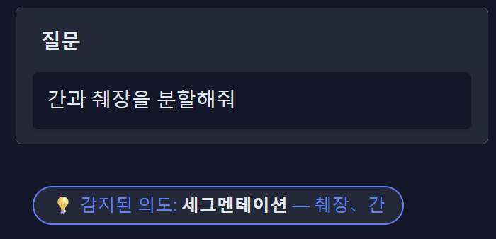

### 2. 다장기 3D 세그멘테이션

* 104종 해부학 구조 지원
* 축상/시상/관상면 시각화
* NIfTI(.nii.gz) 다운로드
* 원본 affine 정보 보존

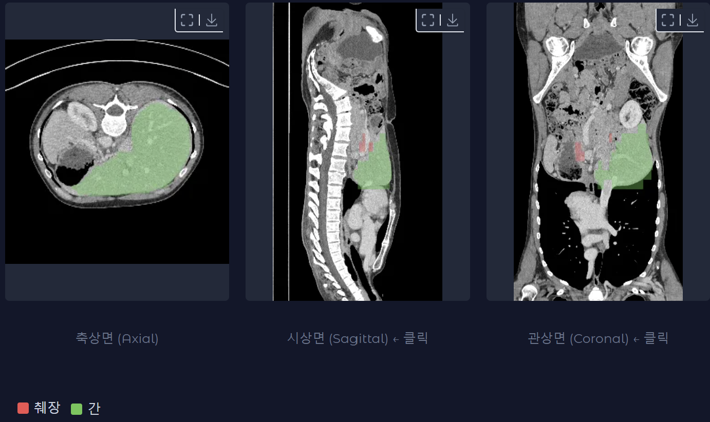

### 3. 임상 정량 분석

| 지표      | 설명              |
| ------- | --------------- |
| 부피 (mL) | 복셀 수 기반 계산      |
| 크기 (mm) | Bounding Box 계산 |
| 상태 평가   | 정상 범위 비교        |

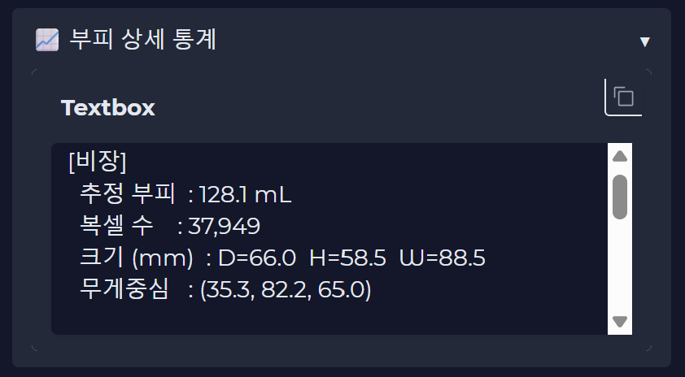

### 4. VQA

자유로운 한국어 질의응답 지원

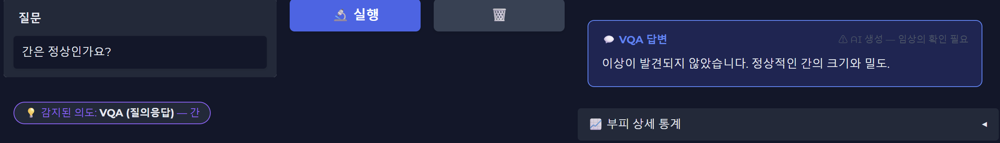

### 5. 소견 생성

CT 전체를 분석하여 소견서를 생성

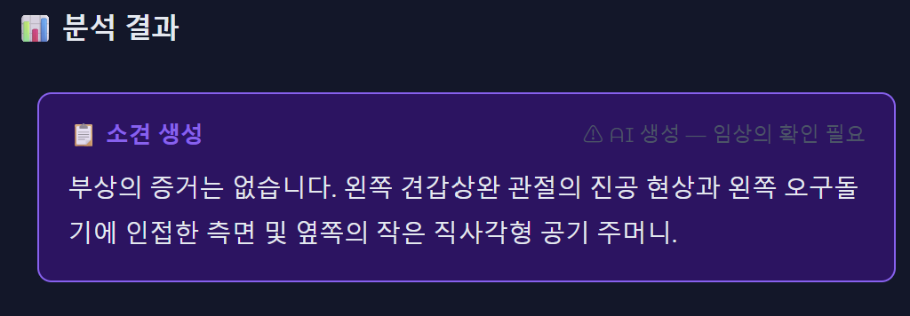

### 6. 영역 설명

장기의 구조와 이상 소견 설명

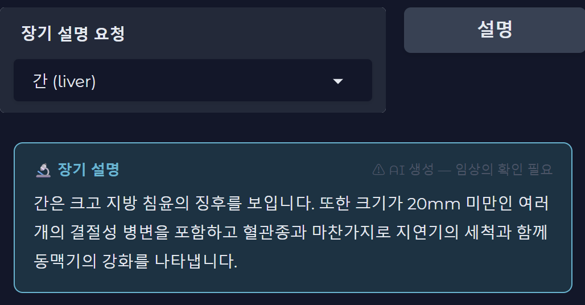

### 7. 환자 관리

* SQLite 기반 저장
* 종단적 추적
* CSV Export

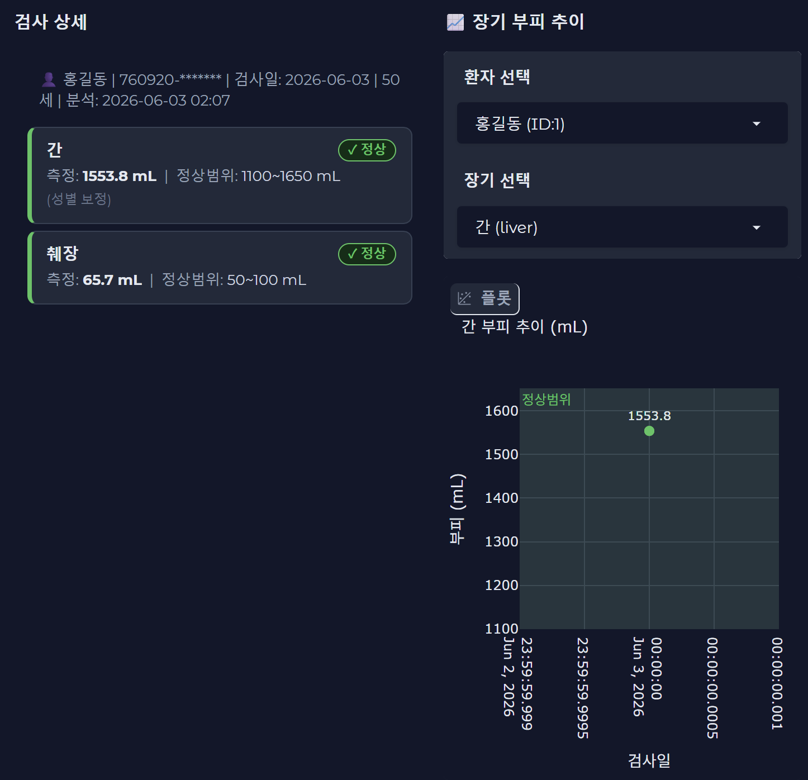

### 8. PDF 보고서

* CT 이미지
* 정량 결과
* 면책 문구 포함

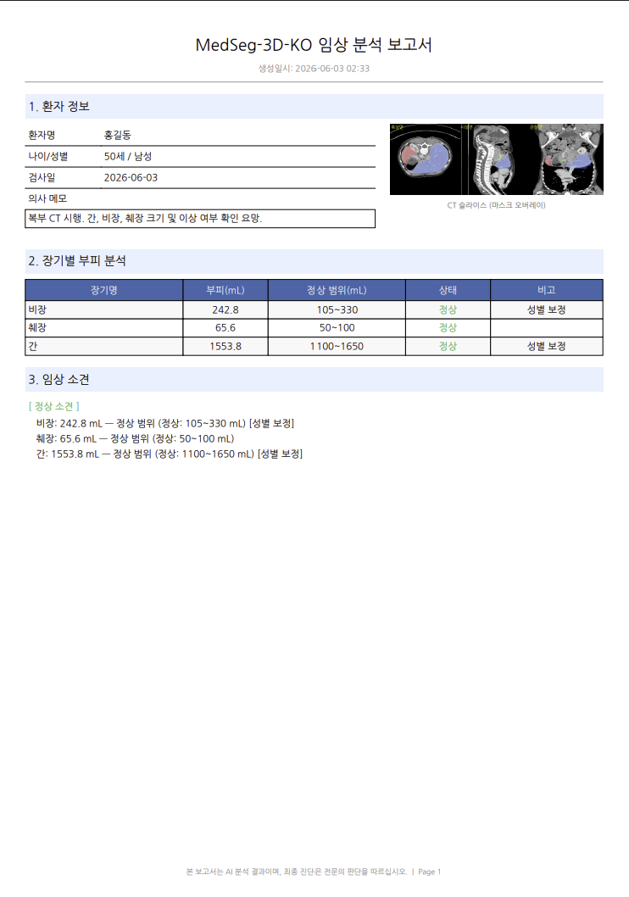

---

## 기술 스택

| 분류              | 기술                                          |
| --------------- | ------------------------------------------- |
| Base Model      | M3D-LaMed-Phi-3-4B                          |
| Deep Learning   | PyTorch, MONAI, Transformers                |
| Medical Imaging | SimpleITK, nibabel                          |
| UI              | Gradio                                      |
| Database        | SQLite                                      |
| Visualization   | Plotly, OpenCV                              |
| Translation     | Gemini 1.5 Flash, Google Translate Fallback |
| Environment     | Google Colab T4                             |

---

## 핵심 실험 결과

> 전체 실험은 EXPERIMENT.md 참고

본 연구는 개념 검증(Proof of Concept)을 목표로 수행되었으며 모든 실험은 동일한 5개 케이스(Task07 Pancreas, MSD)에서 비교 평가하였습니다.

### 실험 1. 번역 전략 비교

| 방법            |    평균 Dice |
| ------------- | ---------: |
| 한국어 직접 입력     |     0.0000 |
| 일반 번역         |     0.0000 |
| Layer 2 정규화   |     0.5457 |
| Full Pipeline | **0.5515** |

### 실험 2. Ablation Study

| 설정       |    평균 Dice |
| -------- | ---------: |
| Full     | **0.5515** |
| −Layer 1 |     0.1083 |
| −Layer 2 |     0.0000 |
| −Layer 3 |     0.0000 |

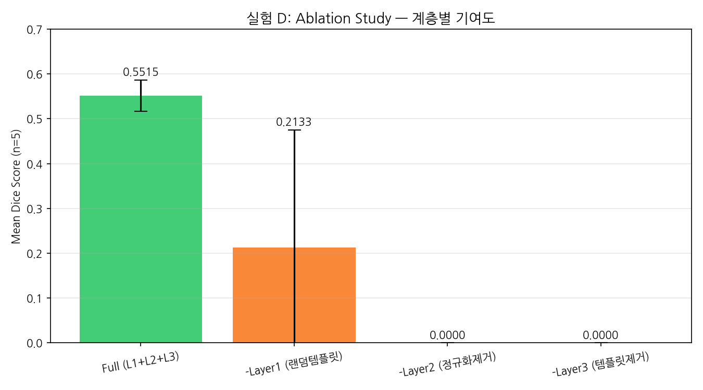

---

## 한계 및 향후 과제

### 1. 출력 번역 품질

초기 버전은 GoogleTranslator를 사용했으며 의료 용어가 음차되거나 의미가 왜곡되는 문제가 있었습니다.

예시:

```text
원문:
"There are andates in the liver."

Google Translate:
"간에 안다테(andates)가 있습니다."
```

이처럼 일부 전문 용어가 그대로 음차되어 임상적 의미를 파악하기 어려운 경우가 발생했습니다.

현재는 Gemini 1.5 Flash를 우선 사용하고, API 키가 없는 경우 Google Translate로 자동 fallback 됩니다.

### 2. VQA 특정 병명 질의 신뢰도

특정 질환을 직접 묻는 질문은 신뢰도가 낮을 수 있습니다.

### 3. 실험 규모 한계

* 단일 장기(췌장)
* 5개 케이스
* 추가 검증 필요

### 4. Layer 1 오분류

규칙 기반 분류기의 한계가 존재합니다.

### 5. Grounding 미구현

M3D 공식 Grounding 태스크는 구현되지 않았습니다.

---

## Quick Start

1. notebooks/m3d_KO_run.ipynb 실행
2. 모델 로드
3. 공개 URL 접속
4. CT 업로드
5. 한국어 질의 입력

---

## 데이터셋

| 데이터셋                  | 설명           | 용도    |
| --------------------- | ------------ | ----- |
| Task07 Pancreas (MSD) | 췌장 CT 281케이스 | 정량 평가 |
| NVIDIA Sample CT      | 복부 CT        | 데모    |

---

## Disclaimer

본 프로젝트는 연구 및 교육 목적의 프로토타입입니다.

생성된 세그멘테이션 결과, 임상 수치, 보고서 및 질의응답 결과는 의학적 진단을 대체할 수 없으며 실제 의료 행위에 사용되어서는 안 됩니다.
