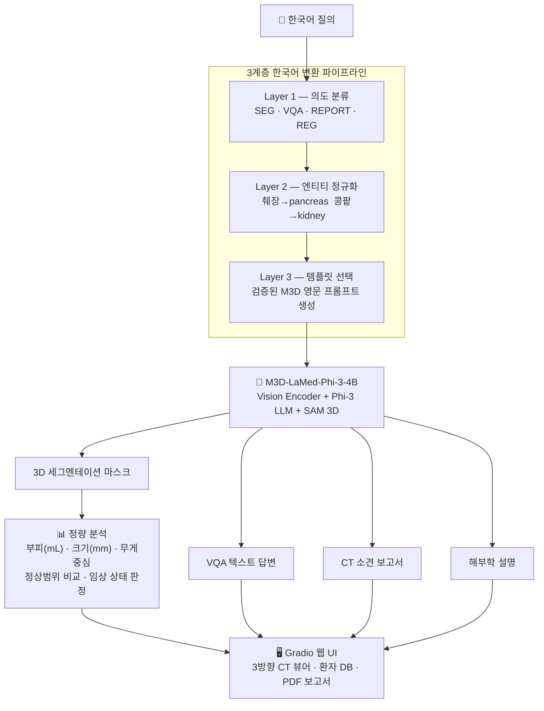
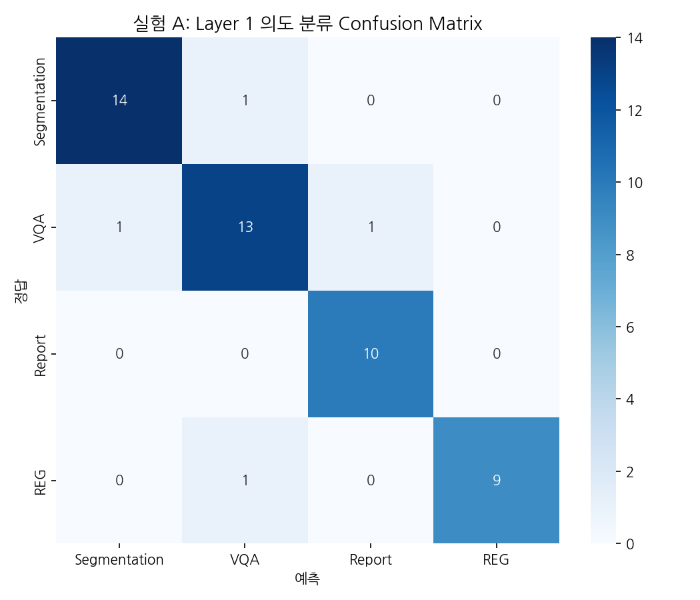
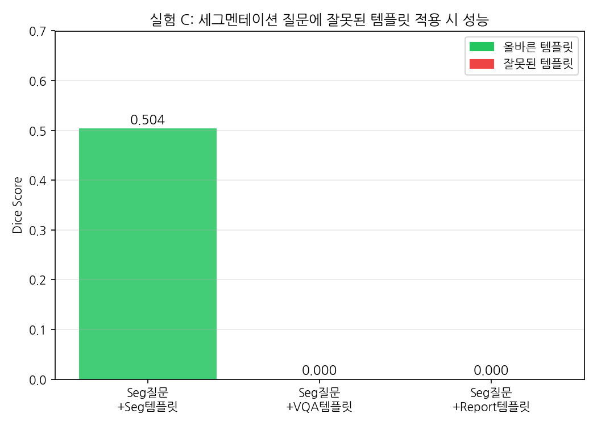

# MedSeg-3D-KO

<div align="center">

### M3D 기반 한국어 지원 3D 의료 CT 세그멘테이션 시스템

**한국어로 질문하면 CT에서 장기를 자동 세그멘테이션하고 임상 분석 결과를 제공하는 시스템**


</div>

---

<!-- 메인 UI 스크린샷 -->


---

## 📌 프로젝트 소개

MedSeg-3D-KO는 영어 기반 3D 의료 영상 VLM인 **M3D-LaMed**를 한국어 환경에서 사용할 수 있도록 확장한 임상 실용화 특화 세그멘테이션 시스템입니다.

기존 M3D 모델은 영어 프롬프트만 지원하여 한국어 의료 질의를 처리할 수 없었습니다. 본 프로젝트는 **3계층 한국어 변환 파이프라인**을 설계·실험하고, 이를 기반으로 한국어 자연어 질의, 다장기 세그멘테이션, 임상 분석, VQA, 자동 소견 생성까지 지원하는 Gradio 웹 애플리케이션을 구현했습니다.

### 핵심 기여

| 기여 | 설명 |
|------|------|
| 🔬 **3계층 변환 파이프라인 설계** | 6종류 실험을 통해 한국어 → M3D 프롬프트 변환 최적 구조 도출 |
| 🧠 **멀티태스크 한국어 인터페이스** | SEG / VQA / REPORT / REG 4가지 분석 유형 한국어 지원 |
| 📊 **임상 정량 분석** | 부피·크기 자동 계산 + 정상범위 비교 + 연령·성별 보정 |
| 🏥 **환자 관리 시스템** | SQLite 기반 환자 히스토리 + 종단적 추이 분석 |

---

## 🏗️ 시스템 아키텍처



### 디렉토리 구조

```
MedSeg-3D-KO/
├── app/
│   ├── gradio_app.py          # Gradio 웹 앱 메인
│   └── visualization.py       # 3방향 슬라이스 시각화
├── src/
│   ├── translation/
│   │   ├── pipeline.py        # 3계층 변환 파이프라인 (핵심)
│   │   ├── translator.py      # 한↔영 번역 레이어
│   │   └── medical_terms.py   # 104종 의료 용어 사전
│   ├── inference/
│   │   ├── model_loader.py    # M3D 모델 로드
│   │   └── segmentation.py    # 추론 파이프라인
│   ├── analysis/
│   │   ├── volume.py          # 부피·크기 계산
│   │   ├── clinical.py        # 정상범위 비교 / 임상 평가
│   │   ├── report.py          # PDF 보고서 생성
│   │   └── morphology.py      # 형태학적 분석
│   ├── database/
│   │   ├── db.py              # SQLite 연결 및 초기화
│   │   ├── models.py          # 테이블 스키마
│   │   └── crud.py            # 환자 CRUD
│   └── auth/
│       └── auth.py            # 사용자 인증
├── config/
│   ├── model_config.py        # 모델 설정
│   └── dataset_config.py      # 데이터셋 설정
├── data/
│   ├── examples/              # 예시 CT (.npy × 7)
│   └── organ_mapping/         # 장기 매핑 JSON
├── evaluation/
│   └── metrics.py             # Dice / IoU 평가 지표
├── notebooks/
│   ├── m3d_KO_run.ipynb                              # Colab 실행 스크립트
│   ├── Med3D_Korean_Interface_Pipeline_Experiment.ipynb  # 실험 1, 2, 3, 4
│   ├── Korean_Medical_Query_Transformation_Experiment.ipynb  # 실험 5, 6, 7
│   └── M3D_KO_Prompt_Optimal.ipynb                   # 실험 8
└── requirements.txt
```

---

## 🛠️ 기술 스택

| 분류 | 기술 |
|------|------|
| 베이스 모델 | M3D-LaMed-Phi-3-4B (HuggingFace) |
| 딥러닝 | PyTorch 2.2, MONAI 1.3, Transformers 4.41 |
| 의료 영상 | SimpleITK 2.3, nibabel 5.2 |
| 번역 | deep-translator (GoogleTranslator) |
| UI | Gradio 4.0+ |
| 시각화 | Plotly, Matplotlib, OpenCV, PIL |
| DB | SQLite3 |
| 보고서 | fpdf2 |
| 실행 환경 | Google Colab T4 GPU |

---

## 🔬 3계층 한국어 변환 파이프라인

본 프로젝트의 핵심으로, 아래 6종 실험을 통해 도출한 최적 구조입니다.

### Layer 1 — 의도 분류 (Intent Classification)

키워드 기반 규칙 분류기로 한국어 질의를 4가지 M3D 태스크로 분류합니다.

| 태스크 | 트리거 키워드 | M3D 태스크 |
|--------|-------------|-----------|
| **SEG** | 분할, 세그, 마스크, 찾아, 보여, 표시 | 3D 세그멘테이션 |
| **REPORT** | 소견, 리포트, 보고서, 진단, 판독 | CT 소견 생성 |
| **REG** | 설명, 기능, 역할, 구조, 묘사 | 해부학 설명 |
| **VQA** | (기타) 어때, 정상, 이상, 문제 | 자연어 질의응답 |

> 우선순위: SEG > REPORT > REG > VQA

### Layer 2 — 엔티티 정규화 (Medical Entity Normalization) ← **가장 중요**

한국어 장기명 → M3D 학습에 사용된 영문 canonical form으로 변환합니다.

- **104종** 의료 용어 사전 기반
- 구어체 처리: `"이자"` → `pancreas`, `"콩팥"` → `kidney`, `"왼쪽 폐"` → `left lung`
- 이 계층 제거 시 Dice **0.5515 → 0.0000**으로 완전 실패 (실험 7)

> **이유:** M3D의 토크나이저는 Phi-3 기반으로 한국어에 최적화되어 있지 않습니다. 아래 토큰화 비교에서 볼 수 있듯, 같은 의미라도 한국어는 영어보다 훨씬 많은 토큰으로 파편화되어 임베딩 공간에서 전혀 다른 표현이 됩니다.

| 한국어 | 영어 | 한국어 토큰 수 | 영어 토큰 수 |
|--------|------|:---:|:---:|
| 간 | liver | 4 | 2 |
| 신장 | kidney | 3 | 2 |
| 췌장 | pancreas | 5 | 3 |
| 콩팥 | kidney | **7** | 2 |
| 대동맥 | aorta | **6** | 3 |

### Layer 3 — 템플릿 선택 (Task-aware Template Selection)

태스크별 검증된 M3D 프롬프트 형식을 자동 적용합니다.

```
SEG    → "Can you segment the {organ} in this image? Please output the mask."
VQA    → "What is the condition of the {organ} in this image?"
REPORT → "What are the main findings in this medical image? Describe any abnormalities
           or notable observations visible in the scan."
REG    → "Describe the appearance and condition of the {organ} visible in this scan.
           Note its size, shape, and any observable abnormalities."
```

> 이 계층 제거 시 Dice **0.5037 → 0.0000** (실험 6). M3D는 `segment`, `mask` 등 특정 학습 토큰에 강하게 의존합니다.

---

## ✨ 주요 기능

### 1. 한국어 자연어 질의

```
"간 분할해줘"         → SEG    → Can you segment the liver in this image? Please output the mask.
"췌장 상태 어때?"     → VQA    → What is the condition of the pancreas in this image?
"소견서 써줘"         → REPORT → What are the main findings in this medical image? ...
"비장 기능 설명해줘"  → REG    → Describe the appearance and condition of the spleen ...
```

<!-- 스크린샷: 의도 분류 배지 -->


### 2. 다장기 3D 세그멘테이션

- **지원 구조물:** 104종 (TotalSegmentator 기준)
- **3방향 뷰:** 축상(Axial) / 시상(Sagittal) / 관상(Coronal) 동시 표시
- **윈도우 프리셋:** 복부 / 폐 / 뼈 / 뇌 4종 (HU 단위 수동 조절 가능)
- **마스크 다운로드:** NIfTI 형식 (.nii.gz), 원본 affine 정보 보존

<!-- 스크린샷: 세그멘테이션 결과 -->


### 3. 임상 정량 분석

| 지표 | 설명 |
|------|------|
| 부피 (mL) | 복셀 크기 × 복셀 수 |
| 크기 (mm) | 축별 바운딩박스 D × H × W |
| 무게중심 | 3D 좌표 |
| 임상 상태 | 정상 ✅ / 초과 ⚠️ / 미만 ⚠️ |

정상범위는 해부학·영상의학 교과서 기반 성인 기준값, 연령·성별 보정 적용.

| 장기 | 정상 범위 |
|------|-----------|
| 간 | 1,000 ~ 1,500 mL |
| 신장 (편측) | 90 ~ 160 mL |
| 비장 | 100 ~ 314 mL |
| 췌장 | 50 ~ 100 mL |
| 좌폐 / 우폐 | 1,500~3,000 / 1,700~3,500 mL |
| 심장 | 400 ~ 900 mL |

<!-- 스크린샷: 임상 분석 결과 -->


### 4. VQA / 소견 생성 / 영역 설명

<!-- 스크린샷: VQA 결과 -->


### 5. 환자 관리 및 종단적 추이

<!-- 스크린샷: 종단적 차트 -->


- SQLite 기반 환자 정보 저장 (환자명, 성별, 생년, 검사 이력, 장기별 결과)
- 주민등록번호 자동 파싱 (나이/성별/생년월일), 뒷자리 마스킹 `000000-*******`, 암호화 저장
- 검사 이력 조회 및 장기 부피 변화 Plotly 인터랙티브 차트
- CSV 내보내기 (전체 / 환자별)

### 6. PDF 보고서 및 데이터 내보내기

<!-- 스크린샷: PDF 보고서 -->


- 3방향 CT 이미지 + 결과표 + 한국어 면책 고지 포함
- Colab 환경에서 NanumGothic 폰트 자동 설치
- NIfTI 마스크 다운로드 (원본 affine 정보 보존)

---

## 📊 실험 결과

모든 실험은 **Task07 Pancreas (MSD)** 데이터셋의 5개 케이스를 대상으로 Tesla T4 GPU에서 수행되었습니다.

---

### 실험 1: 번역 전략 비교

**의도:** 한국어 입력을 M3D에 전달하는 4가지 방식이 세그멘테이션 성능에 미치는 영향 측정

| 방법 | 평균 Dice | 표준편차 | 비고 |
|------|:---------:|:--------:|------|
| A. 한국어 직접 입력 | 0.0000 | 0.0000 | `[SEG]` 토큰 미생성 |
| B. 일반 번역 (GoogleTranslate) | 0.0000 | 0.0000 | "Split the pancreas" → 실패 |
| C. 의료 사전 정규화 (L2만) | 0.5457 | 0.0314 | L2 단독으로도 급격히 회복 |
| **D. Hybrid (L1+L2+L3)** | **0.5515** | **0.0352** | **전체 파이프라인, 최고 성능** |

> **핵심 발견:** 일반 번역이 의미상 맞더라도 Dice 0.0000. M3D는 `segment`, `mask` 등 특정 토큰 패턴에 강하게 의존하기 때문에, Layer 2 + Layer 3의 동시 적용이 필수적입니다.

---

### 실험 2: 표현 다양성 강건성 (Robustness)

**의도:** 같은 의미의 다양한 한국어 표현을 3가지 파이프라인으로 처리했을 때 강건성 비교 (`pancreas_001` 단일 케이스)

| 표현 | Raw Korean | General Trans | **Hybrid** |
|------|:---:|:---:|:---:|
| "췌장을 분할해줘" | 0.0000 | 0.0000 | **0.5037** |
| "이자를 찾아줘" (구어체) | 0.0000 | 오류 | 오류 |
| "췌장 부위를 세그멘테이션해줘" | 0.0000 | **0.5064** | **0.5037** |
| "췌장이 어디있어?" | 0.0000 | 0.0000 | **0.5037** |
| "췌장" (명사만) | 0.0000 | 오류 | **0.5048** |
| 영어 직접 입력 | **0.5037** | **0.5037** | **0.5037** |

> **핵심 발견:** Raw Korean은 영어 직접 입력을 제외하면 모두 실패. General Trans는 일부 표현에서 작동하지만 오류가 많고 불안정. **Hybrid는 대부분의 표현에서 일관된 성능**을 보입니다. 단, 구어체·혼합어 처리는 아직 개선이 필요합니다.

<!-- 표현 다양성 히트맵 -->


---

### 실험 3: Threshold Sensitivity

**의도:** 세그멘테이션 마스크 이진화 임계값(threshold)이 성능에 미치는 영향 측정

| Threshold | Dice | 예측 복셀 수 |
|:---------:|:----:|:----------:|
| 0.3 | 0.5025 | 73,332 |
| 0.4 | 0.5031 | 71,648 |
| **0.5** | **0.5037** | 70,036 |
| 0.6 | 0.5036 | 68,148 |
| 0.7 | 0.5033 | 66,220 |

> **핵심 발견:** 임계값 변화(0.3~0.7)에 따른 Dice 변화는 0.001 미만으로 매우 안정적. 기본값 **0.5** 사용이 적절합니다.

---

### 실험 4: 프롬프트 엔지니어링 최적화

**의도:** Hybrid 파이프라인이 생성하는 영문 프롬프트 외에, 더 나은 프롬프트 형식이 있는지 22종 × 5케이스 = 110회 추론으로 탐색

**실험 그룹**

| 그룹 | 예시 프롬프트 | 그룹 평균 Dice |
|------|-------------|:---:|
| **Baseline** | "Can you segment the pancreas in this image?" | **0.5500** |
| **CoT** | "First identify abdominal organs, then segment the pancreas." | 0.5496 |
| Spatial | "Segment the pancreas in the upper abdomen." | 0.5162 |
| Length | 명사만 / 1~2단어 | 0.2739 |
| Structured | JSON / key-value 형식 | 0.2185 |
| **Lexical** | identify / isolate / extract pancreas | **0.0000** |

**Top 5 최고 프롬프트**

| 순위 | ID | 프롬프트 | Dice |
|:---:|:---:|---------|:---:|
| 1 | B2 | Can you segment the pancreas in this image? | **0.5517** |
| 2 | B3 | Please segment the pancreas in this image and output the mask. | 0.5513 |
| 3 | CoT2 | First identify abdominal organs, then segment the pancreas. | 0.5507 |
| 4 | CoT1 | Step 1: Locate the stomach. Step 2: Find the pancreas... | 0.5505 |
| 5 | L4 | Please carefully identify and segment the pancreatic tissue... | 0.5487 |

> **핵심 발견:** Hybrid 파이프라인의 프롬프트(0.5515)를 유의미하게 초과하는 형식은 존재하지 않습니다. `segment` · `can you` 패턴이 없는 Lexical 변형(identify/isolate/extract)은 Dice 0.0000으로 완전 실패. CoT · 공간 힌트 · 장문 프롬프트는 미미한 차이만 보입니다.

<!-- 프롬프트 성능 막대그래프 -->


---

### 실험 5: Layer 1 의도 분류 Robustness

**의도:** 규칙 기반 키워드 분류기가 다양한 한국어 표현에 얼마나 강건한가 검증 (50개 paraphrase 테스트셋)

**테스트셋 구성:** SEG 15개 · VQA 15개 · REPORT 10개 · REG 10개

**결과: 정확도 92% (46/50)**

| 클래스 | Precision | Recall | F1 | 샘플 수 |
|--------|:---------:|:------:|:--:|:-------:|
| Segmentation | 1.00 | 0.90 | 0.95 | 15 |
| VQA | 0.91 | 1.00 | 0.95 | 15 |
| Report | 0.93 | 0.93 | 0.93 | 10 |
| REG | 0.87 | 0.87 | 0.87 | 10 |
| **Macro avg** | **0.93** | **0.92** | **0.92** | **50** |

**오분류 케이스 (4건)**

| 질문 | 정답 | 예측 |
|------|:---:|:---:|
| "췌장만 보고싶어" | SEG | VQA |
| "이상 소견 있나?" | VQA | Report |
| "췌장이 정상으로 보여?" | VQA | SEG |
| "신장이 어떤 장기야?" | REG | VQA |

<!-- Confusion Matrix -->


> **핵심 발견:** 규칙 기반 분류기만으로도 Macro F1 0.92 달성. 한국어 의료 질의는 의도별로 비교적 명확한 키워드 패턴을 가집니다. 오분류는 대부분 "보고싶어", "소견 있나?" 같이 경계가 모호한 표현에서 발생합니다.

---

### 실험 6: Layer 3 Task Mismatch (템플릿 선택 필요성 검증)

**의도:** 세그멘테이션 질문에 잘못된 태스크 템플릿을 적용했을 때 성능 저하 측정

| 적용 템플릿 | Dice | 모델 응답 |
|------------|:----:|---------|
| **Seg 템플릿 (올바름)** | **0.5037** | `The segmentation reveals [SEG].` |
| VQA 템플릿 | 0.0000 | `"Atrophic pancreas with calcification."` |
| Report 템플릿 | 0.0000 | `"Numerous liver lesions with peripheral nodular enhancement..."` |

<!-- 실험 C 막대그래프 -->


> **핵심 발견:** 장기명이 정확하게 전달되어도, 잘못된 템플릿에서는 `[SEG]` 토큰이 생성되지 않고 모델이 완전히 다른 태스크를 수행합니다. **Layer 3의 Task-aware Template Selection은 필수**입니다.

---

### 실험 7: Ablation Study (계층별 기여도)

**의도:** 3계층 각각을 제거했을 때 성능 변화 측정 (n=5 케이스)

| 설정 | 평균 Dice | 표준편차 |
|------|:---------:|:--------:|
| **Full (L1+L2+L3)** | **0.5515** | 0.0352 |
| -Layer 1 (랜덤 템플릿) | 0.1083 | 0.2167 |
| -Layer 2 (정규화 제거) | 0.0000 | 0.0000 |
| -Layer 3 (템플릿 제거) | 0.0000 | 0.0000 |

<!-- Ablation 막대그래프 -->


> **핵심 발견:** **Layer 2 > Layer 3 > Layer 1** 순으로 기여도가 큽니다. Layer 2·3 제거 시 모두 Dice 0.0000으로 필수 계층임이 확인됩니다. Layer 1 제거 시에도 평균 0.1083으로 급락하고 분산이 매우 커져(σ=0.2167) 불안정해집니다.

---

## 📚 데이터셋

| 데이터셋 | 설명 | 용도 |
|---------|------|------|
| [Task07 Pancreas (MSD)](http://medicaldecathlon.com/) | 췌장 CT + GT 마스크 281케이스 | 실험 정량 평가 (5케이스 사용) |
| NVIDIA Sample CT | 복부 CT | 데모 및 기능 테스트 (`data/examples/`) |

---

## 🚀 실행 방법 (Google Colab)

> `notebooks/m3d_KO_run.ipynb`를 열어 셀을 순서대로 실행하거나, 아래 코드를 직접 사용하세요.

```python
# 1. 레포 클론 및 패키지 설치
!git clone https://github.com/yuji4/MedSeg3D-KO.git
%cd MedSeg3D-KO
!pip install -r requirements.txt

# 2. 한국어 폰트 설치 (PDF 보고서용)
!apt-get install -y fonts-nanum -q

# 3. 임포트
import sys, torch
sys.path.insert(0, '/content/MedSeg3D-KO')

# 4. 모델 로드 (약 5분 소요)
from transformers import AutoTokenizer, AutoModelForCausalLM

model_name = "GoodBaiBai88/M3D-LaMed-Phi-3-4B"
tokenizer = AutoTokenizer.from_pretrained(
    model_name, model_max_length=512,
    padding_side="right", use_fast=False, trust_remote_code=True,
)
model = AutoModelForCausalLM.from_pretrained(
    model_name, torch_dtype=torch.bfloat16,
    device_map='auto', trust_remote_code=True,
)

# 5. 앱 실행
from src.inference.segmentation import SegmentationPipeline
import app.gradio_app as app_module

pipeline = SegmentationPipeline()
pipeline.model = model
pipeline.tokenizer = tokenizer
pipeline._device = next(model.parameters()).device
app_module._pipeline = pipeline

app_module.demo.queue()
app_module.demo.launch(share=True)
```

> ⚠️ T4 GPU 환경 권장. 모델 로드에 약 5분 소요됩니다.

---

## 🔗 참고

- [M3D: Advancing 3D Medical Image Analysis](https://arxiv.org/abs/2404.00578)
- [M3D GitHub](https://github.com/BAAI-DCAI/M3D)
- [M3D-LaMed-Phi-3-4B (HuggingFace)](https://huggingface.co/GoodBaiBai88/M3D-LaMed-Phi-3-4B)
- [Medical Segmentation Decathlon](http://medicaldecathlon.com/)